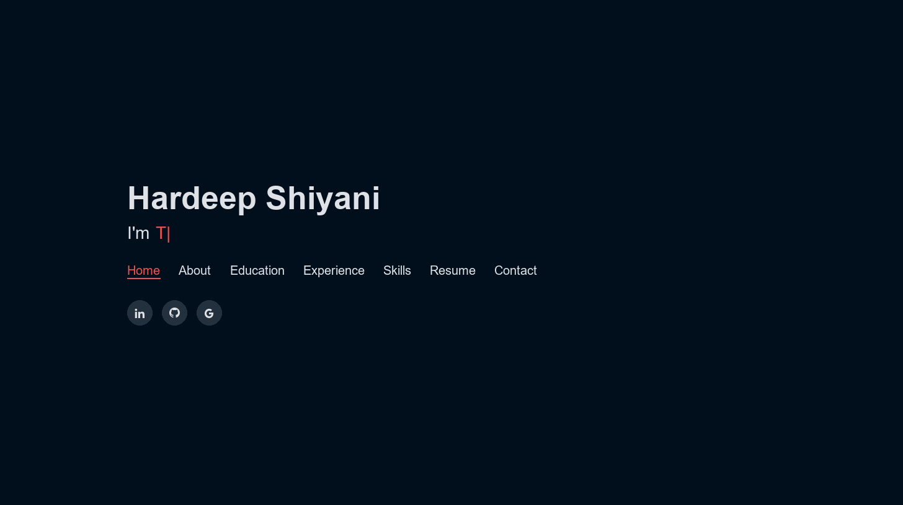
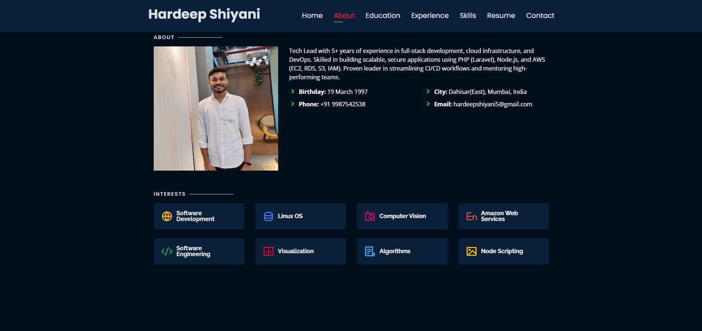

# Hardeep Shiyani — Personal Portfolio

> https://hardeepshiyani.in

[](https://github.com/hardeep-97/hardeep-97.github.io/commits/main)
[](https://hardeepshiyani.in)
[](https://www.linkedin.com/in/hardeep-shiyani)
[](http://badges.mit-license.org)

### Website Preview

#### Home Page



#### About Page



## Features

- Fully Responsive
- Valid HTML5 & CSS3
- Typing animation using `Typed.js`
- Google Analytics integrated

## Sections

- Home
- About & Interests
- Education
- Experience
- Skills
- Resume (PDF)
- Contact

## Tech Stack

- **HTML5 / CSS3 / JavaScript** — static site, no build step required
- **Bootstrap** — responsive layout
- **AWS / Custom Domain** — hosted at `hardeepshiyani.in`
- **Google Analytics** — via gtag.js & GTM

## Deployment

Clone the repository and open `index.html` in a browser, or serve it with any static file server.

```bash
git clone https://github.com/hardeep-97/hardeep-97.github.io.git
cd hardeep-97.github.io
# open index.html or use a local server
npx serve .
```

To deploy, push to your hosting provider or use GitHub Pages with a custom domain.

## License

[](http://badges.mit-license.org)

- **[MIT license](http://opensource.org/licenses/mit-license.php)**
- Template: https://bootstrapmade.com/personal-free-resume-bootstrap-template/
